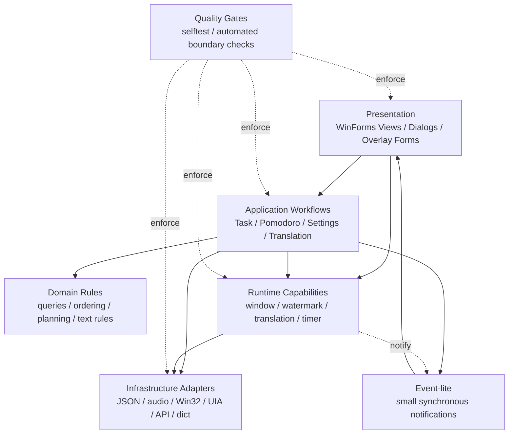

# Clean/Event-driven 目标架构取舍

最后更新：2026-06-22

## 结论

外部 ChatGPT 提出的 Clean Architecture + Event-driven 方案对问题诊断基本正确：当前项目的主要风险不是缺少层级，而是 UI、workflow/service、运行期副作用和系统适配器之间的所有权仍会互相穿透。

本项目采纳目标方向，但不照搬重型实现。最终决策是 `Clean-lite + Event-lite`：用明确模块边界、薄工作流、运行期 facade、系统适配器和自动边界检查解决真实耦合；暂不引入完整 Command Bus、Repository Port、通用 Event Bus 或大规模 OO aggregate 重写。

虚化和翻译完全分开是本决策中的硬边界。二者可以组合运行，但不能互相拥有生命周期、设置字段、窗口布局或资源释放。

## 背景约束

- 技术栈是 PowerShell 5.1 + WinForms 的 Windows 本地常驻小工具。
- 用户价值来自低打扰任务执行、番茄钟、虚化穿透和按需翻译，而不是框架完整性。
- 当前缺陷主要来自状态所有权混乱：翻译启动曾影响主窗口位置/字号，虚化退出曾隐式管理翻译，设置保存曾顺带覆盖窗口字段。
- 因此架构调整必须优先稳定运行期状态、窗口状态和资源生命周期，而不是先做概念性重写。

## 外部方案逐项评价

| 外部方案项 | 评价 | 本项目决策 | 当前落点 |
| --- | --- | --- | --- |
| Presentation / Application / Domain / Infrastructure 分层 | 方向正确，能解释当前耦合来源 | 采纳，但增加 Runtime 和 Quality Gate 两层以适配桌面常驻能力 | `Views.*`、`*Workflow`、`Task*`/`Pomodoro*` 规则模块、`*Runtime`、`TranslationPlatform`、`AutomatedChecks.*` |
| UI 只发 Command，不直接调用 service | 对大型系统合理，但当前会增加排障层级 | 降级采纳：UI 直接调用明确 workflow 函数，不引入通用 Command Bus | `TaskWorkflow.ps1`、`PomodoroWorkflow.ps1`、`SettingsWorkflow.ps1`、`TranslationWorkflow.ps1` |
| Event Bus 驱动所有横切行为 | 可解决横切副作用，但容易隐藏主流程 | 限制采纳：只做同步、进程内、少量 `Event-lite` 通知 | `NotificationHub.ps1`、`AppResultEvents.ps1` |
| Repository Port 抽象 JSON 存储 | 对未来多存储有价值，但当前收益低 | 暂缓：先保持 JSON store facade 和边界检查 | `Storage.ps1`、`TaskStore.ps1`、`SettingsStore.ps1` |
| Domain Entity / Aggregate 重建任务和番茄 | 长期可提高领域表达，但短期改动面大 | 暂缓 OO 化：优先纯函数、显式状态对象、自测覆盖 invariant | `TaskQueries.ps1`、`TaskOrdering.ps1`、`PomodoroSession.ps1`、`PomodoroPlanning.ps1` |
| Translation / Watermark 做横切隔离 | 完全正确，且已被实际 bug 验证 | 完整采纳为硬边界 | `WatermarkRuntime.ps1`、`TranslationRuntime.ps1`、`WindowStateCoordinator.ps1` |

## 目标结构

这里的关键不是箭头数量，而是所有权：workflow 排流程，domain 管规则，runtime 管常驻资源，adapter 管外部能力，quality gate 把约束变成可重复检查。

## 命令与事件边界

UI 事件可以直接调用 workflow facade，例如 `Invoke-TaskAddWorkflow` 或 `Invoke-PomodoroStartWorkflow`。这样比通用 Command Bus 更直接，也更符合当前 PowerShell 模块规模。

事件只用于横切通知：

- `SettingsChanged`：设置保存后通知需要刷新配置的模块。
- `PomodoroFinished`：番茄结束后通知音频、提示和刷新。
- `TranslationCompleted` / `TranslationFailed`：翻译查询和浮层展示解耦。
- `WatermarkModeChanged`：虚化视觉变化后通知需要同步视觉状态的模块。

禁止把主业务顺序藏进事件。如果用户点击按钮后的执行顺序重要，应由 workflow 显式编排。

## 虚化与翻译正交状态

| 组合状态 | 虚化所有者 | 翻译所有者 | 允许行为 | 禁止行为 |
| --- | --- | --- | --- | --- |
| 实化 | `WindowStateCoordinator` + 普通 UI | 无翻译 runtime | 普通任务/番茄/设置 | 创建 UIA timer、加载词典、注册剪贴板 listener |
| 实化 + 翻译 | `WindowStateCoordinator` 保持普通布局 | `TranslationRuntime` | 监听选区、查词、显示翻译浮层 | 启动翻译时进入虚化布局、改任务字号、改主窗口位置 |
| 虚化 | `WatermarkRuntime` | 无翻译 runtime | 改透明度、点击穿透、虚化退出 | 加载翻译词典、调用 UIA/API、管理翻译浮层 |
| 虚化 + 翻译 | `WatermarkRuntime` 与 `TranslationRuntime` 各自管理 | `TranslationRuntime` | 虚化视觉和翻译监听组合运行 | 退出虚化时停止翻译、停止翻译时退出虚化 |

翻译浮层只能读取受控视觉风格和自身字号/位置设置；主窗口位置、任务字号、任务行数和当前视图只能由窗口状态边界管理。

## 迁移策略

1. 优先收敛会导致用户可见异常的边界：窗口状态、字号、timer/listener、浮层和设置保存。
2. 其次收敛历史命名造成的所有权误导，例如 `WatermarkTranslation*` 逐步瘦成兼容 wrapper。
3. 再处理 workflow 过重、领域规则分散和 `$script:` 私有状态外泄。
4. 每个切片只改变一个所有权边界，并补自动检查或自测。
5. 不做一次性大重写；运行中的产品稳定性高于架构形式完整性。

## 验收标准

- 新增 UI 行为必须能说明它调用哪个 workflow 或 runtime facade。
- 新增持久化路径必须说明是否允许写主窗口状态。
- 新增 timer、listener、overlay、hook 必须有明确 runtime 所有者和释放路径。
- 翻译相关改动不得调用虚化进入/退出、主窗口 resize、任务字号应用或通用设置保存。
- 虚化相关改动不得调用取词、词典、API、翻译浮层展示或翻译 runtime 私有字段。
- 自动检查应覆盖新边界；无法自动覆盖时，在对应分文档记录手动冒烟项。