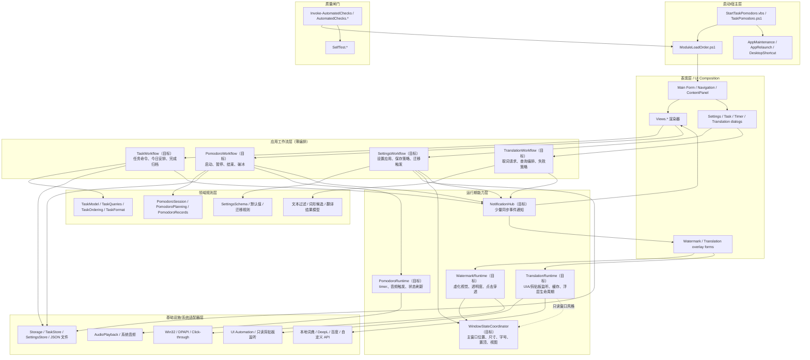

# 架构主文档

最后更新：2026-06-22

## 用途

这是本项目的架构入口文档。后续改动前先读本文件，再按任务类型阅读对应分文档，避免每次从零扫描全部资料，也避免只按最近一次讨论改动而忽略早期边界。

本文件维护稳定的系统边界、目标架构图、模块责任地图、阅读路由和变更检查清单；具体方案、验收标准和历史决策放在分文档中。

## 分文档

- [项目目标与 1.x 架构计划](architecture-plan.md)：Windows 本地优先版本的目标、范围、核心需求和阶段计划。
- [项目章程](project-charter.md)：产品定位、非目标、用户体验原则和需求边界。
- [Clean/Event-driven 目标架构取舍](architecture-clean-event-decision.md)：外部架构方案的采纳、降级、暂缓和虚化/翻译正交决策。
- [2.0 架构决策](v2-architecture-decision.md)：跨平台、低内存方向的存档决策。
- [架构调整执行计划](architecture-refactor-plan.md)：将目标架构拆成可逐步落地、可验证的代码切片。
- [目标架构完成度审计](architecture-completion-audit.md)：当前边界达标状态、有意保留实现细节和后续维护规则。
- [窗口状态与生命周期](window-state-lifecycle.md)：启动、单实例、窗口位置、字号、虚化、点击穿透和翻译叠加状态。
- [翻译增强功能计划](watermark-translation-plan.md)：翻译入口、取词路径、本地词典、API、隐私和验收。
- [收集箱、执行记录与昨日接续计划](inbox-execution-continuity-plan.md)：收集页、行为事件、执行记录和次日接续边界。
- [自动化测试与可维护性](testing-maintenance.md)：自动检查入口、测试分层、自测边界和手动冒烟。
- [发布检查清单](release-checklist.md)：打包、发布前检查和版本产物。
- [音频资源](audio-sources.md)：番茄钟音频来源、许可和资源约束。
- [来源材料](source-materials.md)：外部资料、素材和决策依据的索引。

## 当前架构诊断

当前代码已经从单脚本拆成多个 PowerShell 模块，并通过 `ModuleLoadOrder.ps1` 固定加载顺序。加载顺序仍不等于架构边界；本轮调整已经把高风险的窗口状态、虚化、翻译、设置保存、任务 UI、番茄 UI、音频和通知边界收敛到明确所有者，并用自动检查防回退。

完整 Clean Architecture、Command Bus、Repository Port 和复杂 Event Bus 对当前 PowerShell WinForms 常驻小工具过重。目标架构应采用 `Clean-lite + Event-lite`：保留轻量技术路线，把 UI 组合、薄工作流、领域规则、运行期能力、基础设施适配器和质量闸门分清；只在横切副作用上使用少量同步事件通知。

已形成的局部改进包括：任务菜单构造与动作分离、设置页壳与设置行分离、音频播放适配器与番茄钟音频策略分离、翻译平台/词典/浮层/设置/运行时分离。`TranslationPlatform.ps1` 已接管 DPAPI/Win32 平台 helper，历史 `WatermarkTranslation.Platform.ps1` 只保留兼容 wrapper。这些局部边界应上升为全局目标架构，而不是只在出过问题的文件上打补丁。

本轮架构调整已经完成的主线是：虚化和翻译正交化、窗口状态写入单点化、设置保存策略分层化、Views 复合操作工作流化、边界检查制度化。

## 目标架构总则

目标不是把 PowerShell WinForms 小工具重写成教科书式企业架构，而是把最容易出错的所有权分清。每个模块先回答三个问题：它拥有哪类状态、可以启动或释放哪些资源、是否允许写入用户持久化设置。

| 层级 | 判断标准 | 核心输出 |
| --- | --- | --- |
| 启动/宿主层 | 只负责进程入口、模块加载、单实例和重启 | 稳定启动流程，不承载业务规则 |
| 表现层 | 只创建控件、渲染状态、收集用户意图 | WinForms 控件和事件入口 |
| 应用工作流层 | 把用户意图编排成清晰步骤，不直接持有 UI 控件或系统句柄 | `TaskWorkflow`、`PomodoroWorkflow`、`SettingsWorkflow`、`TranslationWorkflow` |
| 领域规则层 | 可自测、尽量纯函数，不依赖窗口、timer、网络或剪贴板 | 查询、排序、状态迁移、文本过滤、词形规则 |
| 运行期能力层 | 拥有 timer/listener/overlay/window 状态等生命周期资源 | `WindowStateCoordinator`、`WindowChrome`、`WatermarkRuntime`、`TranslationRuntime`、`PomodoroRuntime` |
| 基础设施适配器层 | 封装外部能力，不决定产品流程 | JSON、音频、Win32/DPAPI、UIA、API、本地词典文件 |
| 质量闸门 | 把边界变成可重复检查 | `Invoke-AutomatedChecks`、`SelfTest`、边界检查脚本 |

因此，后续修改优先按“状态所有权”而不是“文件名相近”找落点。虚化、翻译、番茄、设置和窗口状态可以协作，但不能互相拥有对方的生命周期或持久化字段。

## 外部 Clean/Event-driven 方案评估

详细逐项评价见 [Clean/Event-driven 目标架构取舍](architecture-clean-event-decision.md)。主文档只保留结论：外部方案对问题诊断成立，但实现方式需要按本项目体量降级。

| 方案项 | 决策 | 原因 |
| --- | --- | --- |
| 分层方向 | 采纳 | UI、workflow、domain、runtime、adapter 和 quality gate 必须分清，否则继续出现窗口状态、虚化、翻译和设置互相污染。 |
| 虚化/翻译横切隔离 | 完整采纳 | 这是已被实际 bug 验证的硬边界；虚化和翻译可以组合，但不能互相拥有生命周期或设置字段。 |
| Event-driven | 限制采纳 | 只做同步、进程内、少量通知；不把主业务顺序藏进事件。 |
| Command Bus | 暂不采纳 | 当前 WinForms 事件直接调用明确 workflow 更可读、更容易排障。 |
| Repository Port | 暂不采纳 | 本地 JSON 存储固定，先用 store facade 和自动检查控制依赖。 |
| OO Aggregate 重写 | 暂不采纳 | PowerShell WinForms 小工具优先用纯函数、显式状态对象和自测覆盖规则。 |

因此目标架构是 `Clean-lite + Event-lite`，不是一次性 Clean Architecture 重写。后续改动按所有权切片推进：先稳窗口状态和运行期资源，再收敛命名和 workflow，最后处理纯渲染和文件体积。

## 当前问题到目标边界的映射

| 当前结构风险 | 目标所有者 | 收敛方式 | 不采用的做法 |
| --- | --- | --- | --- |
| Service/workflow 变重，开始同时做 UI 响应、规则、持久化和系统调用 | `*Workflow` 只做薄编排，规则下沉 `Domain`，系统能力下沉 `Runtime/Adapter` | 新增行为先判断是用户意图、规则、资源生命周期还是外部能力，再放入对应层 | 不引入通用 Command Bus 来包住所有按钮点击 |
| 主窗口位置、字号、视图、虚化快照和运行中 chrome 分散写入 | `WindowStateCoordinator.ps1` / `WindowChrome.ps1` | 主窗口字段持久化、虚化前布局快照、窗口恢复和运行中透明度/置顶/点击穿透都经窗口边界 | 不让翻译、局部设置或浮层模块直接写主窗口字段 |
| 虚化和翻译曾被实现成“虚化-翻译”子模式 | `WatermarkRuntime.ps1` 与 `TranslationRuntime.ps1` 分别拥有 | 两个 runtime 可组合运行；菜单入口可以相邻，但生命周期、timer/listener、设置字段完全分离 | 不用启动翻译来隐式进入虚化，不用退出虚化来隐式管理翻译内部资源 |
| UI 层直接串联任务、番茄、设置、音频等多种副作用 | `TaskWorkflow.ps1`、`PomodoroWorkflow.ps1`、`SettingsWorkflow.ps1` | UI 只表达用户意图和保留必要对话框；跨领域动作委托 workflow | 不把 WinForms 对话框硬搬到无 UI 的 domain 层 |
| 翻译浮层、取词、词典/API、运行时状态混在历史 `WatermarkTranslation*` 命名里 | `TranslationRuntime`、`TranslationBridge`、`TranslationWorkflow`、`TranslationSurface`、`TranslationSelection`、`TranslationDictionary`、`TranslationLookup`、`TranslationProviders`、`TranslationSettings` | 历史文件逐步瘦成兼容 wrapper，新策略进入中立 `Translation*` 模块 | 不继续在 `WatermarkTranslation*` 里新增产品策略 |
| Event-driven 容易被扩大成隐藏主流程 | `NotificationHub.ps1` + 少量显式事件 | 只用于设置变更、翻译完成/失败、番茄完成等横切通知；顺序重要时继续 workflow 明确编排 | 不引入通用复杂 Event Bus，不把普通按钮点击事件化 |
| 新想法、执行过程和次日接续容易膨胀成第二套任务系统或统计系统 | `InboxWorkflow`、`BehaviorEvents`、`ExecutionRecords`、`DailyContinuity` | 收集箱只做任务前缓冲，行为事件只做内部最小事件流，执行记录以任务聚合，昨日接续只处理昨日 Today 未完成项 | 不做 dashboard、全局监控、Codex 直接写 Today 或翻译历史记录 |

## 迁移状态快照

当前采用渐进式迁移，不另起一套大框架重写。代码中已经建立的目标边界包括：

- `WindowStateCoordinator.ps1`：收敛主窗口位置、尺寸、置顶、透明度和窗口字段持久化选择。
- `WindowChrome.ps1`：收敛运行中主窗体 chrome 写入，包括透明度、置顶、虚化标志、退出热区和点击穿透。
- `SettingsWorkflow.ps1`：把通用设置、保留窗口设置、翻译设置和翻译运行期设置保存策略分开。
- `NotificationHub.ps1`：提供少量同步事件通知，已用于设置、翻译和番茄完成等横切响应。
- `AppResultEvents.ps1`：承载既有 result object 的中立事件构造、合并和分发入口。`PomodoroEvents.ps1` 承载番茄专属事件对象 facade、语义构造函数和记录事件字段构造；`PomodoroEventSets.ps1` 承载状态转换对应的事件集合，避免状态机依赖 `PomodoroCoordinator.ps1` 这个副作用执行器或手写 result event 协议。
- `TaskWorkflow.ps1`、`PomodoroWorkflow.ps1`、`TranslationWorkflow.ps1`：把 UI 意图逐步收敛到薄工作流；其中 `TranslationWorkflow.ps1` 拥有翻译请求防抖和最近已显示状态。
- `WatermarkRuntime.ps1` 与 `TranslationRuntime.ps1`：把虚化和翻译拆成两个可组合 runtime，分别拥有自己的启动/停止、活动状态、timer/listener 句柄和资源释放。
- `TranslationPlatform.ps1`、`TranslationSurface.ps1`、`TranslationBridge.ps1`、`TranslationSelection.ps1`、`TranslationProviders.ps1`、`TranslationDictionary.ps1`、`TranslationRules.ps1`、`TranslationLookup.ps1`：把翻译平台 helper、浮层、桥接接线、取词、在线 provider、本地词典、文本规则和查询编排从历史 `WatermarkTranslation*` 命名中迁出；其中 DPAPI/Win32 helper 已由 `TranslationPlatform.ps1` 接管，浮层表单、字体、定位和隐藏 timer 已由 `TranslationSurface.ps1` 接管，本地词典实现已由 `TranslationDictionary.ps1` 接管。

达标后仍需维护约束的部分：

- 历史 `WatermarkTranslation*` 文件名仍保留为兼容 wrapper；新增产品策略优先进入中立 `Translation*` 模块，且 wrapper 防回退检查禁止真实实现重新写回历史文件。
- 番茄 timer tick、阶段启动、暂停/继续、idle work 重置、当前绑定任务字段、设置/会话时长变更写入和任务行倒计时只读快照、会话时长阶段查询、背景音淡出阶段传递、番茄工作流只读快照和设置保存后的运行态刷新已收敛到 `PomodoroRuntime` 边界；只读查询 facade 拆入 `PomodoroRuntime.Queries.ps1`，破冰状态机、计时器 UI action 和任务右键菜单也通过该查询边界读取运行态。`UiTimer.ps1` 继续作为全局 UI tick 编排层，番茄状态机分支有意保留在 `PomodoroEngine.ps1` / `PomodoroStarter.ps1`。
- `Views.Timer.ps1` 的计时器标签、按钮启停和设置入口已统一读取 `PomodoroRuntime.Queries.ps1` 的 timer view 快照，视图层不再直接知道 `TimerState`、`TimerPhase`、`SecondsRemaining` 等私有字段。
- `Views.Timer.Starter.ps1` 的破冰完成选择对话框已通过 `PomodoroRuntime.Queries.ps1` 获取当前绑定任务 id，不再直接读取 `CurrentPomodoroTaskId`。
- `PomodoroEngine.ps1` 的状态机分支已通过 `PomodoroRuntime.Queries.ps1` 的 Engine 快照读取 state/phase/current task/started-at，不再直接读取这些 runtime 私有字段。
- `SelfTest.Pomodoro.ps1` 与 `SelfTest.Tasks.ps1` 的番茄运行态断言已通过 `PomodoroRuntime.Queries.ps1` 读取，不再直接固化 runtime 私有字段名。
- `PomodoroSession.ps1` 已接管连续轮次边界：Engine、设置对话框和自测通过 session facade 读取/推进连续轮次，不再直接访问 `PomodoroSessionStartedCount` 或 `PomodoroSessionMaxRounds`。
- `WindowDrag.ps1` 已通过 `WindowStateCoordinator.ps1` 读取和写入运行中窗口位置；拖动手势层不再直接访问 `$script:Form.Location`。
- `WindowSize.ps1` 已通过 `WindowStateCoordinator.ps1` 读取和写入运行中窗口高度与最小尺寸；该模块只保留任务行数高度换算和尺寸按钮状态。
- `WindowPlacement.ps1` 是窗口状态边界内的屏幕放置 helper：安全落点和屏幕工作区计算不再放在 `WindowSize.ps1`。`WindowChrome.ps1` 是同一边界内的运行期 chrome helper：虚化模块不再直接写主窗体透明度、置顶、虚化标志或点击穿透。
- 第 60 切片后，窗口、虚化、翻译、番茄和设置的高风险边界已完成七成多收敛；窗口/虚化 chrome 已进入窗口边界，历史翻译 wrapper 已有防回退检查，窗口状态、任务菜单、设置视图、翻译模块、音频播放和通知 hub 质量闸门已按目标边界拆分。
- 第 61 切片补齐了第 60 切片后的完成度审计，并把残留的点击穿透/置顶写入收口到 `WindowChrome.ps1`；后续按审计结果处理番茄 tick 调用链和设置保存调用点。
- 第 62 切片收口了番茄 tick 完成入口：`UiTimer.ps1` 只委托 `Views.Timer.Actions.ps1` 的 `Complete-PomodoroTickFromUi`，不再直接释放 runtime completion guard。
- 第 63 切片新增 `PomodoroResults.ps1` 接管 `New-PomodoroOperationResult`，`PomodoroEngine.ps1` 不再承载被 Starter、Workflow 和 UI action 复用的结果对象 schema。
- 第 64 切片新增 `PomodoroFormat.ps1` 接管 `Format-Time`，计时器视图和行内倒计时不再通过 `PomodoroEngine.ps1` 获取文本格式化 helper。
- 第 65 切片为设置保存调用点补充意图命名：应用生命周期保存走 `Save-AppLifecycleSettings`，运行期字段保存走 `Save-AppRuntimeSettings`，裸 `Save-Settings` 只保留在底层存储和自测夹具。
- 第 66 切片新增 `PomodoroEvents.ps1` 接管 `New-PomodoroEvent` 与 `Add-PomodoroResultEvents`，`PomodoroCoordinator.ps1` 只保留 result event 副作用执行入口。
- 第 67 切片把番茄背景音、开始音、提醒、记录追加和任务番茄数递增的事件 shape 收敛到 `PomodoroEvents.ps1`，状态机不再散写事件类型字符串。
- 第 68 切片把休息结束后的下一轮决策迁入 `PomodoroPlanning.ps1`，`PomodoroEngine.ps1` 不再直接判断任务剩余番茄数来决定下一轮。
- 第 69 切片把工作完成、休息完成、中断和跳过休息的记录事件构造迁入 `PomodoroEvents.ps1`，Engine 不再计算记录事件的 planned/actual/result 字段。
- 第 70 切片把启动番茄时的任务查找与绑定对象构造迁入 `PomodoroPlanning.ps1`，Engine 不再直接查任务来绑定当前任务。
- 第 71 切片把任务变更导致计时器停止的编排迁入 `PomodoroWorkflow.ps1`，`PomodoroEngine.ps1` 只保留番茄/休息状态分支。
- 第 72 切片把预计番茄的启动前判断、启动时补写、休息后追加判断和追加写入迁入 `PomodoroPlanning.ps1`，Workflow 不再直接读写任务估算字段。
- 第 73 切片把破冰启动时的任务查找与绑定对象构造迁入 `PomodoroPlanning.ps1`，`PomodoroStarter.ps1` 不再直接查任务实体。
- 第 74 切片把番茄状态转换对应的事件集合迁入 `PomodoroEventSets.ps1`，Engine 不再拼底层事件数组或读取开始音设置。
- 第 75 切片把主脚本中的数据检查保存和窗体关闭保存改为 `SettingsWorkflow.ps1` 命名 facade，`TaskPomodoro.ps1` 不再裸调 `Save-Settings`。
- 第 76 切片把破冰开始、停止和完成对应的事件集合迁入 `PomodoroEventSets.ps1`，`PomodoroStarter.ps1` 不再直接构造底层背景音事件。
- 第 77 切片为历史 `WatermarkTranslation*` wrapper 增加专属行数预算和实现禁用检查，兼容层已从历史风险转为可验证边界。
- 第 78 切片把破冰菜单和完成对话框文案 helper 迁入 `PomodoroFormat.ps1`，`PomodoroStarter.ps1` 只保留破冰状态机与运行态转换。
- 第 79 切片把破冰完成后的默认动作读取迁入 `PomodoroWorkflow.ps1`，`PomodoroStarter.ps1` 不再读取 `StarterDefaultAction` 设置。
- 第 80 切片把破冰分钟数读取迁入 `PomodoroSession.ps1`，`PomodoroStarter.ps1` 不再读取 `StarterMinutes` 设置。
- 第 81 切片完成最终达标审计：高风险边界以 `AutomatedChecks.*`、主脚本自测和定向搜索作为完成证据；剩余历史 wrapper、runtime 内部 `$script:` 字段和自测夹具直连均列为有意保留实现细节。
- `$script:` 状态仍较多；迁移方向是逐步进入 `$App.Ui`、`$App.Window`、`$App.Timer` 或明确 runtime 私有状态，而不是一次性重写。下一步继续把番茄、窗口、虚化和翻译的内部读写收敛到公开 facade 与边界检查。
- `ModuleLoadOrder.ps1` 只保证加载顺序，不等于依赖边界；真实边界必须靠模块契约、自测和 `AutomatedChecks.*` 共同约束。

## 目标架构图



图中的 `*Workflow`、`*Runtime`、`WindowStateCoordinator` 和 `NotificationHub` 是责任边界。部分边界已经有同名模块，部分仍由多个历史模块共同承担；后续改动应优先向这些边界收敛，而不是继续扩大历史文件。

## 目标调用链

目标架构用五条调用链约束日常开发。改动前先判断自己属于哪条链，避免 UI、runtime、adapter 和持久化互相穿透。

| 调用链 | 正向流程 | 返回/通知 | 禁止跨越 |
| --- | --- | --- | --- |
| 用户意图链 | `Views/Dialog` -> `*Workflow` -> `Domain/Runtime/Store facade` | result object 或少量 notification -> UI 刷新 | UI 直接写 JSON、直接改 timer 私有字段、直接组合多个跨领域副作用 |
| 常驻资源链 | `*Runtime` -> 平台 adapter/timer/listener/overlay | runtime facade 暴露活动状态和释放入口 | workflow 或 UI 持有 timer/listener 句柄，runtime 之间互读私有变量 |
| 设置保存链 | `Views.Settings*` -> `SettingsWorkflow` -> `SettingsStore` / `WindowStateCoordinator` | `SettingsChanged` 同步通知 | 局部设置保存顺带写主窗口位置、任务字号或当前视图 |
| 翻译链 | `TranslationSelection` -> `TranslationWorkflow` -> `TranslationLookup` -> `TranslationSurface` | `TranslationCompleted/Failed` -> 浮层显示或轻提示 | 启动翻译时进入虚化布局，翻译浮层写主窗口字段，未开启翻译时加载词典/API |
| 番茄计时链 | `Views.Timer*` -> `PomodoroWorkflow` -> `PomodoroEngine/Starter` -> `PomodoroRuntime` | result event / `PomodoroFinished` -> 记录、音频、UI 刷新 | 视图层散读写 `TimerState`、`TimerPhase`、`SecondsRemaining` 等运行态字段 |

这几条链不是新增框架，而是本项目的排障路线。出现跳位、字号变化、闪烁、timer 泄漏或剪贴板风险时，优先按调用链反查所有权，而不是先改视觉补丁。

## 状态所有权地图

| 状态或资源 | 唯一写入/释放所有者 | 允许读取/请求者 | 硬禁止 |
| --- | --- | --- | --- |
| 主窗口位置、尺寸、任务字号、任务行数、当前视图 | `WindowStateCoordinator.ps1`，通过设置 workflow 或明确窗口操作触发 | UI 渲染、虚化 runtime 读取受控快照 | 翻译 runtime/surface/settings 直接写入；设置局部保存顺带覆盖 |
| 虚化视觉状态与主窗体 chrome | `WatermarkRuntime.ps1` / `WatermarkMode.ps1` 编排，`WindowChrome.ps1` 写主窗体 chrome | `WatermarkToggleButton.ps1`、受控通知 handler | 虚化模块调用翻译取词、词典、API、释放翻译 listener，或直接写 `Form` chrome 字段 |
| 翻译 UIA timer、只读剪贴板 listener、翻译缓存、浮层生命周期 | `TranslationRuntime.ps1` + `TranslationSurface.ps1` | 翻译菜单、翻译设置暂停/恢复、应用关闭清理 | 翻译启动/停止改主窗口布局；虚化退出隐式停止翻译 |
| 番茄运行态字段、阶段时间、完成防重入 | `PomodoroRuntime.ps1`，只读查询在 `PomodoroRuntime.Queries.ps1` | `PomodoroWorkflow.ps1`、`Views.Timer*`、`PomodoroInlineCountdown.ps1` 通过 facade | UI/设置/音频/任务模块直接读写 runtime 私有字段 |
| 任务数据与排序 | `TaskCommands.ps1`、`TaskStore.ps1`、`TaskOrdering.ps1`，用户意图经 `TaskWorkflow.ps1` | `Views.Task.Items.ps1` 做只读投影 | UI 绘制层直接持久化或绕过 workflow 做跨领域副作用 |
| 在线翻译 secret、月度额度、用户词典路径 | `TranslationSettings.ps1` + `SettingsWorkflow.ps1` + provider/lookup adapter | `TranslationProviders.ps1`、`TranslationLookup.ps1` | 普通模式预加载 provider；任何路径写剪贴板或保存原文/译文历史 |


## 目标模块责任地图

| 目标层 | 职责 | 当前主要落点 | 调整方向 |
| --- | --- | --- | --- |
| 启动/宿主层 | 进程入口、模块加载、单实例、重启、快捷方式 | `TaskPomodoro.ps1`、`StartTaskPomodoro.vbs`、`ModuleLoadOrder.ps1`、`AppMaintenance.ps1`、`AppRelaunch.ps1`、`DesktopShortcut.ps1` | 入口只编排启动流程，不承载业务规则；单实例和重启策略继续留在生命周期模块。 |
| 表现层 / UI Composition | 主窗体、导航、内容面板、对话框、浮层表单、控件生命周期 | `Views.*.ps1`、`BottomChrome.ps1`、`HelpSurface.ps1`、`WatermarkGhostSurface.ps1`、`TranslationSurface.ps1`、`WatermarkTranslation.Surface.ps1` | UI 只收集用户意图、渲染状态和管理控件；复杂动作委托给 workflow 或 runtime。 |
| 应用工作流层 | 把 UI 意图编排成任务、番茄、设置、翻译操作；只排流程，不沉淀规则 | 主要落在 `TaskWorkflow.ps1`、`PomodoroWorkflow.ps1`、`SettingsWorkflow.ps1`、`TranslationWorkflow.ps1`、`TranslationLookup.ps1`；历史残留包括部分 `Views.*` 接线和 `WatermarkTranslation.ps1` 兼容入口 | 避免形成上帝 Service；把规则下沉到 Domain，把系统能力下沉到 Runtime/Adapters；查询顺序只留在 lookup/workflow 边界。 |
| 领域规则层 | 纯规则、查询、排序、格式化、计划、词形候选、设置 schema | `TaskModel.ps1`、`TaskQueries.ps1`、`TaskOrdering.ps1`、`TaskFormat.ps1`、`TaskArchive.ps1`、`PomodoroSession.ps1`、`PomodoroPlanning.ps1`、`SettingsSchema.ps1`、`TranslationRules.ps1`、`TranslationDictionary.ps1` 中的词形候选/短释义规则 | 尽量不依赖 WinForms、网络或 `$script:Form`；任务剩余番茄、预计番茄补全、启动任务绑定和下一轮计划判断留在 Planning，不回流 Engine；优先做可自测的纯函数和显式状态迁移。 |
| 运行期能力层 | 主窗口状态、虚化视觉、翻译监听/浮层、番茄 timer、listener/hook 生命周期 | `WindowStateCoordinator.ps1`、`WindowPlacement.ps1`、`WindowChrome.ps1`、`WatermarkRuntime.ps1`、`TranslationRuntime.ps1`、`PomodoroRuntime.ps1`、`PomodoroRuntime.Queries.ps1`、`WindowSize.ps1`、`WatermarkMode*.ps1`、`WatermarkToggleButton.ps1`、`PomodoroEngine.ps1`、`PomodoroStarter.ps1`、`UiTimer.ps1` | 资源启停和状态写入必须有单一所有者；timer/listener/overlay form 必须统一释放。 |
| 基础设施/适配器层 | 文件 IO、JSON 原子写入、音频、Win32、DPAPI、UIA、剪贴板读取、在线 API、本地词典文件 | `Storage.ps1`、`TaskStore.ps1`、`SettingsStore.ps1`、`PomodoroRecords.ps1`、`AudioPlayback.ps1`、`TranslationSelection.ps1`、`TranslationProviders.ps1`、`TranslationDictionary.ps1`、`TranslationPlatform.ps1`；`WatermarkTranslation.Platform.ps1` 仅作兼容 wrapper | 适配器只封装外部能力，不决定产品策略；例如剪贴板适配器只能读，不决定何时启用，provider 只能调用 API，不决定何时联网；DPAPI/Win32 helper 不应继续挂在虚化命名下。 |
| 轻量事件通知 | 少量同步、进程内、可追踪的横切通知 | `NotificationHub.ps1`、`AppResultEvents.ps1`、`PomodoroEvents.ps1`、既有 `AppEvent` 结果事件 | 只用于翻译完成、番茄结束、设置变更等横切副作用；事件对象 helper、事件语义构造和副作用执行器分开，不做通用复杂 Event Bus。 |
| 质量闸门 | 语法、资源、数据、自测、边界检查、打包检查 | `scripts/Invoke-AutomatedChecks.ps1`、`scripts/AutomatedChecks.*.ps1`、`SelfTest*.ps1` | 边界检查按目标边界拆分；窗口状态、任务菜单、设置视图、翻译模块、音频、通知、番茄、任务 workflow 等检查不回流到单个通用脚本。 |

## 任务列表 UI 子边界

任务列表属于表现层，但内部也要继续拆边界，避免 `Views.Task.ps1` 重新变成半业务层：

- `Views.Task.ps1` 只负责列表视图装配、控件创建和注册入口。
- `Views.Task.Items.ps1` 负责任务查询结果到 ListBox item 的只读 UI 投影。
- `Views.Task.Events.ps1` 只负责 Mouse/Drag/DoubleClick/Selection 事件接线。
- `Views.Task.Interactions.ps1` 负责高层交互流程：右键菜单、窗口拖动入口、复选框完成、默认点击动作、预览、内联编辑触发和排序 workflow 委托。
- `Views.Task.Gestures.ps1` 负责低层点击/拖动 mechanics：双击阈值、点击状态、拖动阈值、拖拽数据和目标索引。
- `Views.Task.Selection.ps1`、`Views.Task.Hover.ps1`、`Views.Task.Edit.ps1`、`Views.Task.ListDrawing.ps1` 分别隔离选区、悬浮预览、内联编辑和 owner-draw 绘制。

这条子边界的判断标准是：事件模块只接线，Interactions 只描述用户意图流程，Gestures 只处理 WinForms 手势细节，Items 只做只读投影。任何新增任务列表能力都必须先判断落点，不能把布局、手势、workflow 和渲染重新写回同一个文件。

## 目标依赖矩阵

| 调用方 | 允许依赖 | 禁止依赖 |
| --- | --- | --- |
| UI / Views / Dialogs | 明确的 workflow、runtime facade、只读查询 helper | 直接写 JSON、直接调 OS hook/API、直接组合多个领域副作用 |
| Workflow | 领域规则、runtime facade、存储 facade、少量通知 | WinForms 控件、具体 overlay form、UIA/剪贴板/API 细节 |
| Domain | 输入对象、纯规则、显式状态迁移 | WinForms、timer、文件系统、网络、剪贴板、窗口句柄 |
| Runtime | 自己拥有的 timer/listener/overlay 生命周期、必要 adapter、受控窗口状态读写 | 其他 runtime 的内部变量、业务存储策略、跨领域 UI 重排 |
| Adapter | 外部能力封装，如 JSON、音频、Win32、DPAPI、UIA、API | 产品流程、用户交互策略、窗口布局策略 |
| Notification handler | 小而明确的横切响应 | 隐式主流程、复杂持久化、绕过窗口状态或 runtime 所有权 |

Runtime 之间默认不直接调用内部实现。确需协作时，只能经公开 facade 或 `NotificationHub`，并且调用方向必须表达“请求能力”而不是读写对方内部状态。

## 切片选择规则

后续重构按“先止血、再归属、再瘦身”的顺序推进：

1. 先处理会改变主窗口状态、启动 timer/listener、写设置或触碰系统资源的边界。这类问题会造成跳位、字号变化、闪烁和常驻资源消耗，优先级最高。
2. 再处理概念命名和所有权不清的边界。典型例子是 `WatermarkTranslation*` 历史命名、`$script:` 私有状态外泄、UI 直接访问 runtime 句柄。
3. 最后处理纯可读渲染和文件体积问题。它们影响维护成本，但不应抢在生命周期和状态所有权之前。
4. 每个切片只允许改变一个所有权边界。若同一改动同时碰 UI、runtime、settings 和 adapter，应先拆成文档切片，再分步落地。
5. 每个切片都必须补边界检查或自测；如果无法自动覆盖，必须在分文档写清手动冒烟项。

## 模块命名迁移规则

- `Watermark*` 只代表虚化能力；`Translation*` 代表翻译增强能力。新模块、新函数和新文案优先使用中立翻译命名。
- `WatermarkTranslation*` 是历史兼容命名，允许保留旧函数接线，但不得继续新增跨层策略、WinForms/UIA/API/DPAPI/词典解析实现、复用主窗口布局字段，或在中立 `Translation*` 实现模块内新增历史私有状态。
- `TranslationRuntime` 只拥有翻译生命周期、timer/listener 和浮层清理，不拥有虚化状态；`WatermarkRuntime` 只拥有虚化生命周期，不拥有翻译监听。
- `TranslationSelection`、`TranslationBridge`、`TranslationProviders`、`TranslationDictionary`、`TranslationSurface`、`TranslationSettings`、`TranslationRules`、`TranslationLookup`、`TranslationPlatform` 分别隔离取词、桥接接线、在线 provider、本地词典、浮层渲染、翻译设置 UI、文本规则、查询编排和平台 helper；`WatermarkTranslation.ps1`、`WatermarkTranslation.Dictionary.ps1`、`WatermarkTranslation.Platform.ps1` 只能作为兼容接线层逐步瘦身。

## 虚化与翻译正交化

虚化和翻译是两个可组合但互不拥有的运行期能力。

- `WatermarkRuntime` 只负责虚化视觉：透明度、置顶策略、点击穿透、虚化退出点和虚化状态切换。
- `WatermarkToggleButton` 只负责 `~` 按钮 chrome：创建、显隐、拖动手势、右键菜单入口和退出区域命中判断；它不拥有虚化布局生命周期。
- `TranslationRuntime` 只负责翻译运行期：启动/停止、UIA timer、可选只读剪贴板 listener、运行期缓存和浮层生命周期接线；文本过滤归 `TranslationRules`，查询顺序归 `TranslationLookup`，具体 UIA/剪贴板和 provider 调用归 adapter。`TranslationSurface` 拥有浮层字体、定位、显示/隐藏和释放；它只能读翻译字号与受控视觉风格，不得写主窗口位置、任务字号或视图状态。
- `WindowStateCoordinator` 只负责主窗口状态：位置、尺寸、任务字号、当前视图、任务行数、置顶、持久化窗口字段和虚化前布局快照。
- 翻译可以在实化状态运行，也可以在虚化状态运行；启动翻译不得自动进入虚化布局，停止翻译不得自动退出虚化。
- 虚化状态变化可以影响翻译浮层的视觉风格或点击穿透策略，但只能通过 `WindowStateCoordinator` 或受控通知传递，不得直接调用翻译查词逻辑。
- 翻译浮层位置和翻译字号属于翻译能力；主窗口位置和任务字号属于窗口状态。两组设置不得共用字段或保存路径。

## 行内倒计时展示层

今日任务行右侧的倒计时只是表现层叠加，不拥有任何计时逻辑。它可以读取番茄、休息和 3 分钟破冰的当前状态，并把匹配到任务的运行中节律显示为 `mm:ss`；无倒计时时不占位、不改变任务行布局。

- 3 分钟破冰、番茄和休息的内部状态机保持分离，不能为了统一显示而合并逻辑。
- 番茄绑定任务时，工作阶段倒计时显示在该任务行右侧；进入休息后继续继承上一轮番茄的任务绑定。
- 独立番茄和独立休息没有任务行归属，不应污染今日任务列表；只在番茄视图或全局计时区域显示。
- 任务行绘制只做只读查询和覆盖绘制，不写任务、设置、番茄记录或窗口状态。
- 从今日任务启动番茄时默认留在今日任务页；番茄页保留为详情和全局控制入口。

## 轻量事件规则

本项目只采用 `Event-lite`，不引入完整 Command Bus 或通用 Event Bus。事件是同步、进程内、少量、命名清楚的通知，用来隔离横切副作用，而不是隐藏主流程。

优先允许的事件类型：

- `SettingsChanged`：设置保存后通知 UI、音频或运行期能力刷新。
- `PomodoroFinished`：番茄结束后通知音频、状态提示和记录刷新。
- `TranslationRequested` / `TranslationCompleted` / `TranslationFailed`：翻译流程和浮层展示解耦。
- `WatermarkModeChanged`：虚化视觉变化后通知点击穿透和相关浮层更新。

事件处理规则：

- 事件 handler 不得直接写主窗口位置、尺寸、任务字号或当前视图；需要修改时必须走 `WindowStateCoordinator`。
- 事件 handler 不得调用网络、文件写入和复杂 UI 重排，除非事件名称明确代表该副作用。
- 同一个事件的 handler 数量应少，执行顺序必须可读；如果顺序重要，优先使用 workflow 明确编排，不用事件。
- 不把普通按钮点击包装成事件；UI 可以直接调用 workflow 函数。

## 暂不采用的重型方案

- 不引入完整 Command Bus。WinForms 事件可以直接调用明确的 workflow 函数。
- 不为固定 JSON 存储强行抽 `ITaskRepository`、`ISettingsRepository` 等接口；先用模块边界和边界检查控制依赖。
- 不把每个业务动作都事件化。事件只用于翻译浮层、音频、状态提示、刷新等横切响应。
- 不强行把 Task、PomodoroSession 改成复杂 OO aggregate。优先使用显式状态对象、纯函数状态迁移和自测覆盖 invariant。

## 依赖规则

- 允许主依赖方向：启动层 -> 表现层 -> 应用工作流层 -> 领域规则层 / 运行期能力层 / 基础设施适配器层。
- 领域规则层不得依赖 WinForms 控件、窗口句柄、timer、网络、剪贴板或具体文件路径。
- 基础设施适配器不得决定产品流程；它只提供能力，例如读写 JSON、播放音频、读取 UIA 选区、调用 API。
- UI 渲染器不得直接组合多个跨领域操作；复杂操作应委托给 workflow。任务列表这类 UI 投影可以放在 `Views.*.Items.ps1`，但不得写任务或启动计时器。
- 设置保存不得直接从任意 UI 模块读取主窗体并写入所有窗口字段；窗口状态写入必须经过窗口状态协调边界。
- 翻译模块不得调用窗口尺寸、任务字号、任务行数或视图切换逻辑；它只能请求显示/隐藏翻译浮层或读取受控窗口风格信息。
- 虚化模块不得调用翻译查词、词典、API 或 UIA 取词逻辑；它只能改变虚化视觉和点击穿透状态。
- Timer、listener、overlay form 和系统 hook 必须归属于明确 runtime，并在停止 runtime 时统一释放。

## 架构调整优先级

1. 建立窗口状态协调边界：先不追求大重构，先把主窗口位置、尺寸、任务字号、翻译字号、透明度、置顶、当前视图的写入路径列清楚并收敛。
2. 解耦虚化和翻译 runtime：翻译启动/停止只管理取词、查询、浮层和缓存，不进入虚化布局流程，不保存主窗口状态；虚化对外通过 `WatermarkRuntime.ps1` 暴露视觉和点击穿透能力，不触碰翻译查词逻辑。
3. 拆分设置保存策略：区分“用户修改通用设置”“用户修改窗口设置”“用户修改翻译设置”，避免局部设置保存顺带覆盖主窗口状态。
4. 把 Views 中的复合操作上移到 workflow：由 `TaskWorkflow.ps1` 承接任务 UI 突变，由 `PomodoroWorkflow.ps1` 承接番茄/破冰 UI 编排；菜单和按钮事件只表达意图，workflow 统一调任务、番茄、音频、窗口和持久化。
5. 引入少量同步事件通知：先覆盖 `TranslationCompleted`、`PomodoroFinished`、`SettingsChanged`，不要做通用事件总线。
6. 扩展边界检查：把当前任务菜单、设置、音频、翻译的局部检查，扩展到窗口状态、虚化/翻译正交化和事件使用规则。

## 改动阅读路由

| 改动类型 | 必读分文档 |
| --- | --- |
| 窗口位置、字号、行数、置顶、拖动、单实例、重启 | [窗口状态与生命周期](window-state-lifecycle.md)、[自动化测试与可维护性](testing-maintenance.md) |
| 虚化、点击穿透、`~` 菜单、透明显示 | [窗口状态与生命周期](window-state-lifecycle.md)、[翻译增强功能计划](watermark-translation-plan.md) |
| 翻译取词、浮层、词典、API、剪贴板监听 | [翻译增强功能计划](watermark-translation-plan.md)、[窗口状态与生命周期](window-state-lifecycle.md) |
| 任务清单、今日待办、已结束、任务右键命令 | [项目目标与 1.x 架构计划](architecture-plan.md)、[项目章程](project-charter.md) |
| 番茄钟、破冰启动、任务行倒计时、提醒、音频 | [项目目标与 1.x 架构计划](architecture-plan.md)、[音频资源](audio-sources.md)、[自动化测试与可维护性](testing-maintenance.md) |
| 设置项、默认值、迁移、本地数据 | [窗口状态与生命周期](window-state-lifecycle.md)、[自动化测试与可维护性](testing-maintenance.md) |
| 打包、发布、资源缺失、快捷方式 | [发布检查清单](release-checklist.md)、[自动化测试与可维护性](testing-maintenance.md) |

## 硬边界

- 翻译是叠加能力，不拥有主窗口布局。启动或停止翻译不得修改主窗口位置、宽高、任务字号、当前视图、任务行数或虚化折叠状态。
- 虚化是显示状态，翻译是监听和浮层状态。两者可以组合，但不能把“启动翻译”等同于“重新进入虚化布局”。
- 普通模式和普通虚化模式不得加载词典、创建 API 客户端、注册 UIA timer 或注册剪贴板监听。
- 剪贴板监听只能由用户主动启用，只读真实用户复制内容；不得写剪贴板、模拟 `Ctrl+C`、临时复制或恢复剪贴板。
- 自测默认不得写入真实 `data/` 和 `config/`。只有显式 `-SelfTestInPlace` 才允许验证当前工作区数据恢复逻辑。
- 设置保存如果不是用户明确改窗口位置/尺寸，必须保留当前窗口状态；翻译设置不得顺带保存主窗口位置、字号或视图状态。
- 任何 timer、listener、浮层或全局 hook 都必须有明确的启动条件和释放路径。
- 事件通知不得绕过硬边界；事件 handler 也必须遵守模块所有权和窗口状态写入规则。

## 改动前清单

1. 确认本次改动的目标层：UI、workflow、domain、runtime、adapter 或 quality gate。
2. 确认模块所有者，不跨边界顺手改无关模块。
3. 列出会读写的状态：窗口状态、设置、运行时数据、timer、listener、缓存、外部资源。
4. 确认是否会触发持久化设置；如果会，判断是否必须走窗口状态协调边界或 `PreserveWindow` 类保护。
5. 确认普通模式、虚化模式、翻译模式、设置对话框打开期间分别应该发生什么。
6. 判断是否真的需要事件通知；如果执行顺序重要，优先使用 workflow 明确编排。
7. 确认失败策略：静默、轻提示、可恢复错误或阻断错误。
8. 确认自动检查和手动冒烟范围。

## 验证要求

- 文档或小范围脚本改动至少运行 `git diff --check`。
- PowerShell 代码改动优先运行：

```powershell
powershell -NoProfile -ExecutionPolicy Bypass -File .\task-pomodoro\scripts\Invoke-AutomatedChecks.ps1
```

- 如果正在运行应用且只需要只读质量闸门，可运行：

```powershell
powershell -NoProfile -ExecutionPolicy Bypass -File .\task-pomodoro\scripts\Invoke-AutomatedChecks.ps1 -SkipSelfTest
```

- 涉及窗口、虚化、翻译、点击穿透、音频和长期常驻的改动，还需要手动冒烟。

## 文档维护规则

- 新增模块或拆分模块时，更新目标模块责任地图，并确认 `ModuleLoadOrder.ps1` 和边界检查是否需要同步。
- 新增生命周期状态、timer、listener、浮层、全局交互能力时，更新 [窗口状态与生命周期](window-state-lifecycle.md)。
- 新增翻译取词路径、词典来源、API provider 或隐私边界时，更新 [翻译增强功能计划](watermark-translation-plan.md)。
- 新增测试入口、自测策略或发布闸门时，更新 [自动化测试与可维护性](testing-maintenance.md)。
